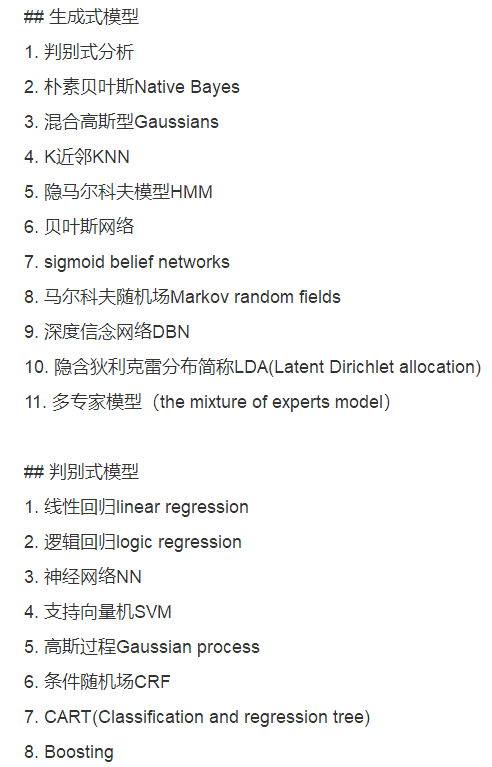

# 深度学习笔记

- **计算梯度的方法：**数值法，解析法，反向传播法

- **反向传播**：一种计算所有可能的路径变化率的求和的方式；一种追踪权重和偏置微小变化的传播，抵达输出层影响代价函数的技术

- 为什么要介绍**二次代价函数**：权重和偏置的变动太微小了，需要一个间接评量

- 通常是在**犯错的比较明显的时候**学习的速度很快

- **交叉熵**是非负的，正确率高时接近0，避免了学习速度下降

- **规范化**的网络受限于根据训练数据中常见的模式来构造相对简单的模型，而能够抵抗训练数据中的噪声的特性影像

- 只通过**线性变换**，人一层的全链接神经网络和单层神经网络模型的表达能力没有区别

- **交叉熵：**一个样本中有两个概率分布，*p*为真实分布，*q*为非真实分布。用非真实分布q来表示真实分布p的平均编码长度，则为：
  $$
  H(p,q) = -\sum p(x)*logq(x)
  $$
  ，即为交叉熵（刻画的是两个概率分布之间的距离)

- 

- 

- 神经网络初始化方法：**xavier**

- 

- 

## 编码器

- 稀疏自编码器
- 变分自编码器
- 限制玻尔兹曼机
- 深度信念网络