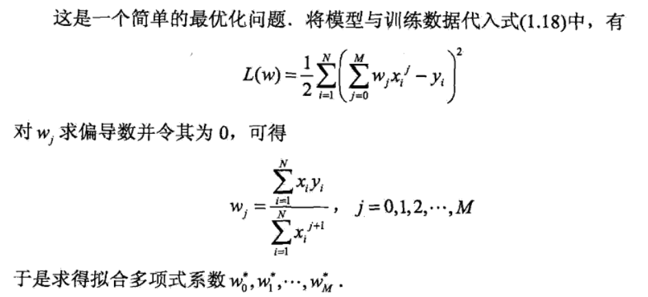

## 不懂之处

1. 
2. 
3. 

## 机器学习三要素

1. 模型
2. 策略——损失函数
3. 算法——优化方法

## 范数

- L0范数：表示向量中非零元素的个数
- L1范数：表示向量中每个元素绝对值的和
  - 对于线性回归模型，使用L1正则化的模型建模叫做**Lasso**回归
- L2范数：表示向量中每个元素平方和的平方根
  - 对于线性回归，使用L2正则化的模型叫做**Ridge**回归（岭回归）
- L1会趋向于产生少量的特征，而其他的特征都是0，而L2会选择更多的特征，这些特征都会接近于0。Lasso在特征选择时候非常有用，而Ridge就只是一种规则化而已。
- https://www.cnblogs.com/MengYan-LongYou/p/4050862.html
- 如果矩阵表达的是结构性信息，例如图像、用户-推荐表等等，那么这个矩阵各行之间存在这一定的相关性，那这个矩阵一般就是低秩的

## NP问题

- P问题：能在多项式的时间里找到解决问题的算法
- NP问题：可以在多项式的时间里猜出一个解的问题。P属于NP
- NPC问题：1.是一个NP问题；2.所有NP问题可以归约到该问题
- NP-Hard问题：所有NP问题可以归约到该问题

## 特征值与奇异值

- https://blog.csdn.net/xiaocong1990/article/details/54909126

## k-近邻

- kd树
  - ？

## 决策树

- CART？
- 基尼指数？？

## logistic回归与最大熵模型

- 都是对数线性模型
- 二项logistic回归模型：分类模型
- 多项logistic回归
- 最大熵模型
- 优化算法：
  - 通用迭代算法(GIS)
  - 改进的迭代尺度法(IIS)
  - 牛顿法、拟牛顿法(BFGS)

## 支持向量机

- 凸优化问题

  - 凸二次规划问题

- 线性可分SVM：

  - 最大间隔法

  - 对偶形式：
    $$
    f(x)=sign(\sum_{i=1}^{N}a_{i}^{*}y_{i}(x\cdot x_{i})+b^{*})
    $$

- 拉格朗日函数，KKT条件用于满足原始问题==对偶问题：

  - https://blog.csdn.net/johnnyconstantine/article/details/46335763
  - https://www.cnblogs.com/90zeng/p/Lagrange_duality.html

- 线性SVM

  - 三要素：

    - **模型**：分离超平面
      $$
      w\cdot x+b=0
      $$
      及决策函数
      $$
      f(x)=sign(w\cdot x+b)
      $$

    - **策略**：软间隔最大化

    - **算法**：凸二次规划

  - 合页损失函数

- 正定核
  - Gram矩阵
  - 希尔伯特空间：https://blog.csdn.net/weixin_36811328/article/details/81207753
  - 再生核希尔伯特空间

## boosting

- 三要素：
  - 模型：加法模型
  - 损失函数：指数函数
  - 学习算法：前向分步算法v
- 提升树模型——决策树的加法模型
- 梯度提升算法

## EM算法

- 期望极大算法
  - 一种近似计算含有隐变量概率模型的极大似然估计的方法
- 应用在**高斯混合模型**(Gaussian mixture model, GMM)
  - https://blog.csdn.net/lin_limin/article/details/81048411

|              | 已知                                 | 未知                                         |
| ------------ | ------------------------------------ | -------------------------------------------- |
| 极大似然估计 | 1. 采样数据 2. 数据分布模型     | 数据分布模型参数                             |
| EM算法       | 1. 采样数据 2. 各个类的分布模型 | 1. 各个模型的参数 2. 采样数据属于哪一类 |

## 隐马尔可夫模型（HMM）

- 生成模型

- **三要素**

  - 初始状态概率
  - 状态转移概率矩阵
  - 观测概率矩阵

- **基本假设**

  1. 齐次马尔科夫性假设：当前状态只与前一时刻状态相关
  2. 观测独立性假设：当前观测只依赖于时刻的状态

- **三个基本问题**

  1. 概率计算问题：已知模型和观测序列，求该序列出现的概率
  2. 学习问题：已知观测序列，求模型参数，使得观测序列在该模型下概率最大（极大似然法估计）
  3. 预测问题（解码问题）：已知模型和观测序列，求该观测模型最有可能对应的状态序列

  |                      | 已知           | 求                                         |
  | :------------------: | :------------- | :----------------------------------------- |
  |     概率计算问题     | 模型、观测序列 | 该序列出现的概率                           |
  |       学习问题       | 观测序列       | 模型参数（使得观测序列在该模型下概率最大） |
  | 预测问题（解码问题） | 模型、观测序列 | 最有可能对应的状态序列                     |

- **概率计算算法**

  1. 直接计算法：计算量O(TN^T)
  2. 前向算法：计算量O(N^2T)
  3. 后向算法

- **学习算法**

  1. 监督学习——数据需要进行标注，成本高
  2. Baum-Welch算法——无监督的EM算法

- **预测算法**

  1. 近似算法
  2. 维特比算法（动态规划） 

## 条件随机场(conditional random field, CRF)

- 判别模型
- logistic回归是用于分类的对数线性模型；CRF是用于序列化标注的对数线性模型
- 每一个HMM模型都等价于某个CRF
- **三个基本问题**

  1. 概率计算问题
  2. 学习问题
  3. 预测问题

- **概率无向图模型（马尔可夫随机场）**

| 成对马尔可夫性 | 两个无边节点条件独立                     |
| -------------- | ---------------------------------------- |
| 局部马尔可夫性 | 节点与自身非连接的节点条件独立           |
| 全局马尔可夫性 | 被一个节点集合隔开的两个节点集合条件独立 |

  - 三者等价？
  - 如果联合概率分布P(Y)满足成对、局部或者全局马尔可夫性，称此联合概率分布为**概率无向图模型（马尔可夫随机场）**
  - **团**：一个团中任意两个节点都有边连接
  - **因子分解(factorization)**：将概率无向图的联合概率分布表示为最大团上的随机变量的函数的乘积形式
  - **势函数？Hammersley-Clifford定理？**
  - **条件随机场**：给定随机变量X条件下，随机变量Y的马尔可夫随机场
  - **线性链条件随机场**：线性链表示；输出节点只与对应的输入节点、输出节点前后两个节点相关

