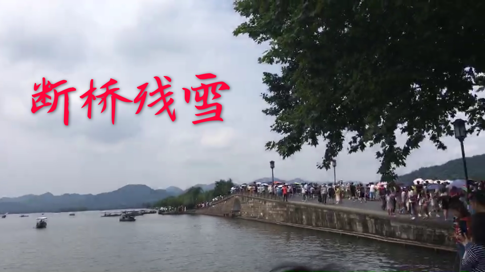
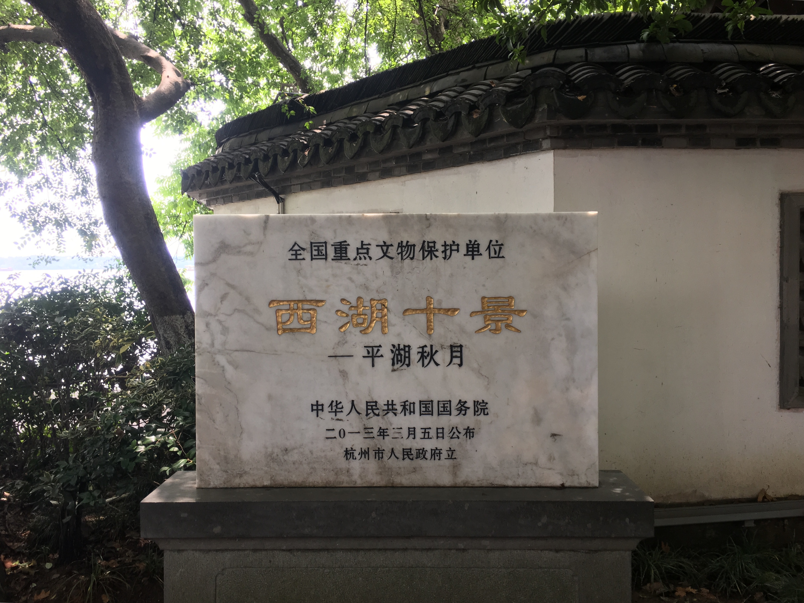
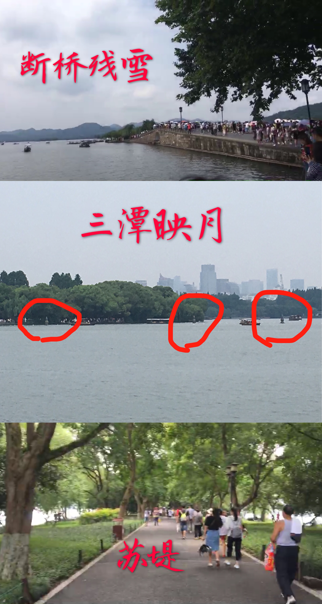

# 欲把西湖比西子，淡妆浓抹总相宜

第一次来到杭州，将在这里呆一个多月，也是第一次在南方呆这么久，所以来之前就打算有时间一定要好好逛逛。刚来的一星期就一直在下雨，周六雨变小了，在实验室呆了一天，想着无论周日雨多大一定要出去。还好天公作美，周日雨停了天晴了，一大早就动身出发去西湖。

经过公交地铁的辗转，从二号线的凤起路站走出来，瞬间感受到了南方太阳的毒辣。沿着导航一路走，终于隔着茫茫多的人看到了西湖，也终于看到了断桥残雪…… 

好吧，听说只有下了雪才有机会看到断桥的样子。从断桥残雪进去就是白堤了，一路两边都是树，树两边都是湖……

走过白堤就到了西湖十景之一的平湖秋月，这没啥继续走。

出了孤岛一拐就到苏堤了，这是苏轼当年带人修出来的堤，所以叫苏堤。风景也差不多，但是在苏堤上可以远远望到三潭映月。

