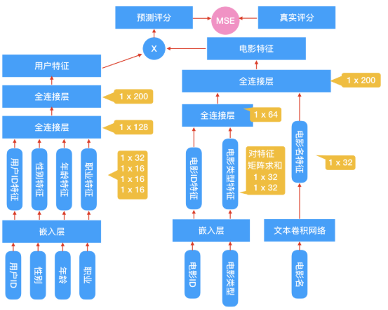
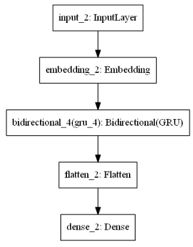

# 李英豪——NLP相关了解（三）

- 了解应用于NLP的卷积神经网络： <http://www.wildml.com/2015/11/understanding-convolutional-neural-networks-for-nlp/>
  - NLP任务的输入是表示为矩阵的文本，所以滤波器的宽度通常与输入矩阵的宽度相同
  - 更适合分类任务
  - 字符级CNN对于大型数据集非常有效，在较小数据集上表现不佳。

## 实践

- 基于LSTM的文本分类
  - 遗忘门，用来让 LSTM忘记之前没有用的信息。
  - 输入门，LSTM 来决定当前输入数据中哪些信息将被留下来。
  - 输出门，LSTM 在得到最新节点状态后，结合上一时刻节点的输出和当前时刻节点的输入来决定当前时刻节点的输出。
  - 过程：
    - 语料加载
    - 分词和去停用词
    - 数据预处理
    - 使用 LSTM 分类
- 基于CNN的电影推荐系统
  - 
- 基于LSTM生成古诗
  - 语料准备
  - 语料预处理
  - 模型参数配置
  - 构建模型
  - 训练模型
  - 模型作诗
  - 绘制模型网络结构图
    - 
    - 

